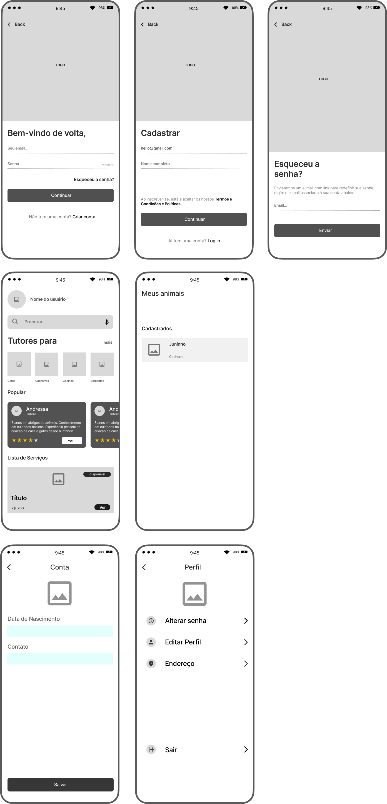
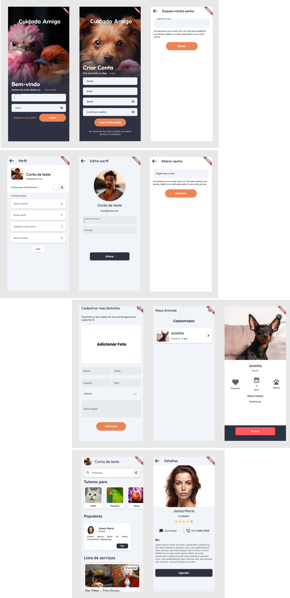
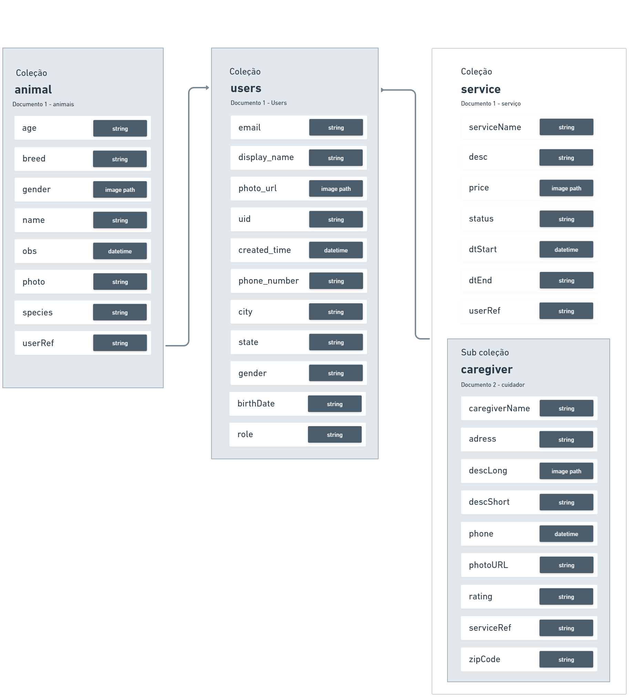

## Índice

1. [Cuidado Amigo](#Cuidado-Amigo)
2. [Tech Stack](#Tech-Stack)
3. [Imagens do Projeto](#Imagens-do-Projeto)
4. [instalação](#Instalação)


## Cuidado Amigo

Cuidado amigo é o aplicativo definitivo para todos os tutores de animais de estimação, seja você o orgulhoso dono de um adorável cachorro, um coelho independente, ou até mesmo um amante de animais exóticos. Este projeto foi criado com um único objetivo em mente: tornar a vida dos tutores de animais mais fácil, mais organizada e mais seguro, encontrando cuidadores ideais para cuidar do seu animalzinho em sua ausência.


## Tech Stack

**Front-end/Client:** Dart com Framework Flutter

**Back-end as Service:** Firebase

Esta é uma aplicação MVP (Minimum Viable Product), com muitas implementações ainda a serem desenvolvidas. É importante estar ciente de que podem surgir inconsistências durante o seu uso, uma vez que esta versão inicial foi concebida para fornecer funcionalidades básicas.

## Imagens do Projeto


<br>



## Modelo de Dados



## Instalação

- Instalação apk no seu celular android:
[Release](https://github.com/raphaelabenom/cuidadoAmigo-app/releases) pode ser testado usando emulador [BlueStacks](https://www.bluestacks.com/download.html)
<br>
- Certifique-se de ter instalado o Flutter SDK, Dart SDK e o Android Studio em seu computador.

- Faça o download do projeto em seu computador local.

- Abra o Android Studio e selecione a opção (Abrir um projeto existente do Android Studio).

- Navegue até a pasta do projeto que você baixou e selecione a pasta do projeto.

- Aguarde o Android Studio importar o projeto.

- Quando o Android Studio concluir a importação do projeto, você poderá ver a estrutura do projeto no painel esquerdo.

- Selecione o arquivo "pubspec.yaml" no painel esquerdo e clique no botão "Get dependencies" (Obter dependências) na parte superior.

Antes de executar o projeto, execute os seguintes comandos:

```bash
  flutter pub get
  flutter packages pub run build_runner build --delete-conflicting-outputs
```
Essa ação produzirá os arquivos essenciais para a compilação do projeto.

- Aguarde o Android Studio baixar e instalar todas as dependências do projeto.

